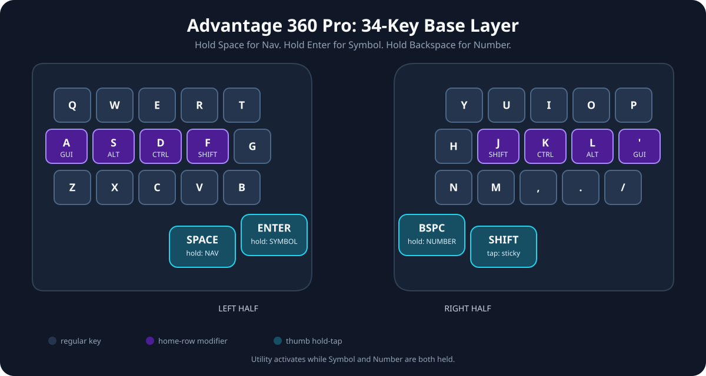
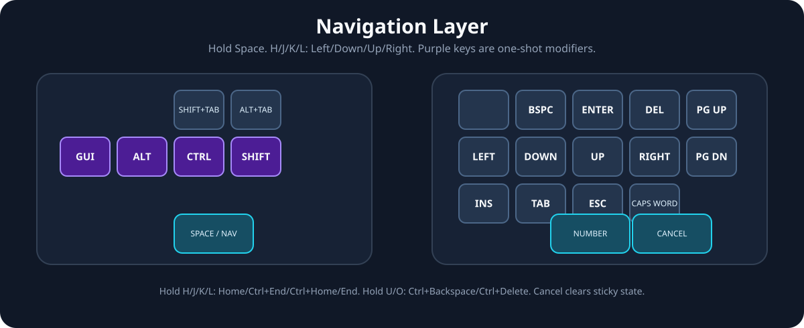
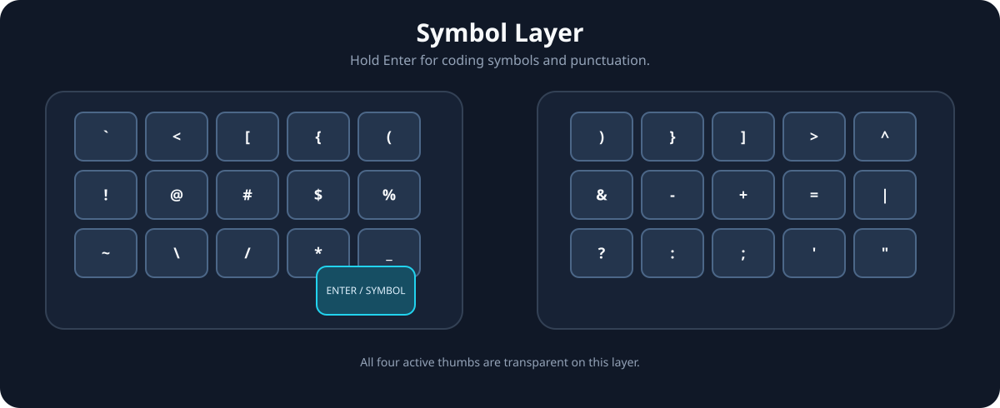
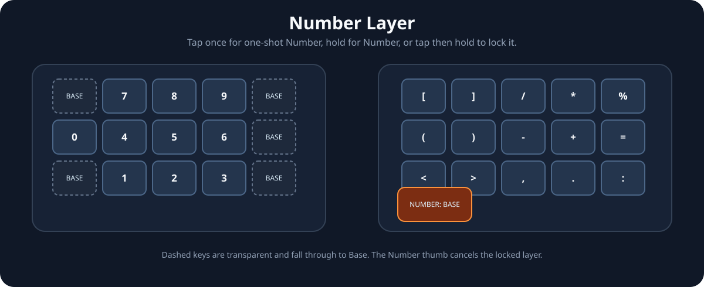
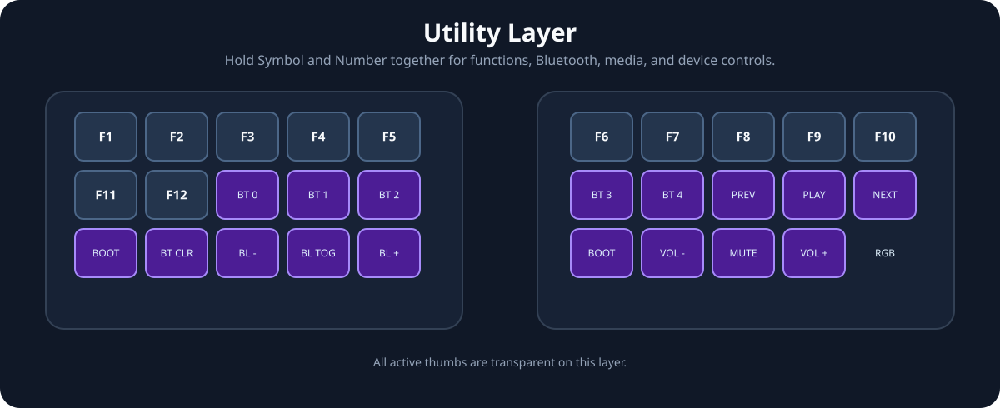

# 34-Key Layout Reference

This is a reference for the active 34 keys in `config/adv360.keymap`. All other physical Advantage 360 positions are disabled except the mirrored top-inner keys (positions 6 and 7), which enter bootloader mode.

`Nav` is held with Space. Tap either Symbol or Number once for a one-shot layer, hold it for momentary access, or tap then hold it for 250 ms to lock the layer. Press its thumb while a layer is locked to return to Base. Hold Space and tap the Shift thumb to cancel active layers, Sticky Shift, and pending one-shot layers. Enter is available on the Navigation layer. Holding Symbol and Number together activates Utility. `-` is an unbound key and `Trans` uses its Base-layer binding.

## Base

| Left | Keys | Right | Keys |
| --- | --- | --- | --- |
| Top | Q W E R T | Top | Y U I O P |
| Home | GUI/A Alt/S Ctrl/D Shift/F G | Home | H Shift/J Ctrl/K Alt/L GUI/' |
| Bottom | Z X C V B | Bottom | N M , . / |
| Thumbs | Space/Nav (65), Symbol (66) | Thumbs | Number (69), Shift (70) |

The mirrored top-inner keys enter bootloader mode directly from Base: position 6 on the left and the original right-side `KP` key (position 7), immediately right of the physical `5` key.

## Navigation

| Left | Keys | Right | Keys |
| --- | --- | --- | --- |
| Top | - - - - - | Top | Home Backspace Enter Delete End |
| Home | GUI Alt Ctrl Shift - | Home | Page Down Left Down Right Page Up |
| Bottom | - - - - - | Bottom | Insert Tab Escape Caps Word - |
| Thumbs | Trans, Trans | Thumbs | Trans, Cancel |

## Symbol

| Left | Keys | Right | Keys |
| --- | --- | --- | --- |
| Top | Grave < [ { ( | Top | ) } ] > ^ |
| Home | ! @ # $ % | Home | & - + = \| |
| Bottom | ~ \\ / * _ | Bottom | ? : ; ' " |
| Thumbs | Trans, Base/Cancel | Thumbs | Trans, Trans |

## Number

| Left | Keys | Right | Keys |
| --- | --- | --- | --- |
| Top | Trans 7 8 9 Trans | Top | [ ] / * % |
| Home | 0 4 5 6 Trans | Home | ( ) - + = |
| Bottom | Trans 1 2 3 Trans | Bottom | < > , . : |
| Thumbs | Trans, Trans | Thumbs | Base/Cancel, Trans |

## Utility

| Left | Keys | Right | Keys |
| --- | --- | --- | --- |
| Top | F1 F2 F3 F4 F5 | Top | F6 F7 F8 F9 F10 |
| Home | F11 F12 BT 0 BT 1 BT 2 | Home | BT 3 BT 4 Previous Play/Pause Next |
| Bottom | Bootloader Clear BT Backlight - Backlight Toggle Backlight + | Bottom | Bootloader Volume - Mute Volume + RGB Toggle |
| Thumbs | Trans, Trans | Thumbs | Trans, Trans |
